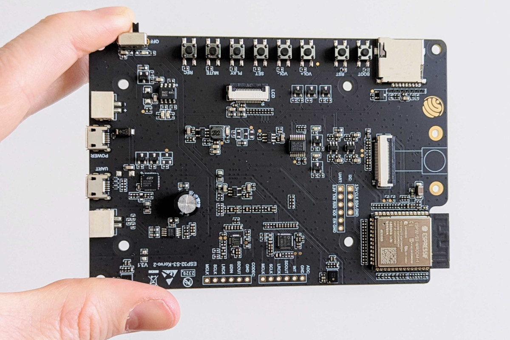

<div align="center">
  <picture>
    
  </picture>
  <picture>
    <source media="(prefers-color-scheme: dark)" srcset="docs/BioDCASE_header_light.svg">
    <source media="(prefers-color-scheme: light)" srcset="docs/BioDCASE_header_dark.svg">
    
  </picture>
  <picture>
    
  </picture>
  <br><br>
</div>

<!-- <div align="center">
  <picture>
    
  </picture>
  <br><br>
</div> -->

This repository contains the development framework for the **BioDCASE-Tiny 2026 competition (Task 3)**, focusing on TinyML implementation for bird species recognition on the ESP32-S3-Korvo-2 development board.

For complete competition details, visit the [official BioDCASE 2026 Task 3 website](https://biodcase.github.io/challenge2026/task3).

## Background

BioDCASE-Tiny is a competition for developing efficient machine learning models for bird audio recognition that can run on resource-constrained embedded devices. The project uses the ESP32-S3-Korvo-2 development board, which offers audio processing capabilities in a small form factor suitable for field deployment.

## Table of Contents
- [Setup and Installation](#setup-and-installation)
- [Usage](#usage)
- [Dataset](#dataset)
- [Development](#development)
  - [Data Processing Pipeline](#data-processing-pipeline)
  - [Model Training](#model-training)
  - [ESP32-S3 Deployment](#esp32-s3-deployment)
- [ESP32-S3-Korvo-2 Development Board](#esp32-s3-korvo-2-development-board)
- [Code Structure](#code-structure)
- [Development Tips](#development-tips)
- [Evaluation Metrics](#evaluation-metrics)
- [License](#license)
- [Citation](#citation)
- [Funding](#funding)
- [Partners](#partners)

## Setup and Installation

### Prerequisites

1. Python 3.11+ with pip and venv
2. [Docker](https://www.docker.com/get-started) for ESP-IDF environment
3. USB cable and ESP32-S3-Korvo-2 development board

### Installation Steps

1. Clone the repository:
```bash
git clone https://github.com/birdnet-team/BioDCASE-Tiny-2026.git
cd BioDCASE-Tiny-2026
```

2. Create a virtual environment (recommended)

```bash
python3 -m venv .venv
source .venv/bin/activate
```

3. Install Python dependencies:
```bash
pip install -e .
```

4. Set your serial device port in the pipeline_config.yaml

```yaml
embedded_code_generation:
  serial_device: <YOUR_DEVICE> 
```

### Running on Windows

As the required tflite-micro package is not easily available for Windows we recommend using WSL to run this project.

To make your device accessible for WSL you can use this guide: https://learn.microsoft.com/en-us/windows/wsl/connect-usb 

To determine your serial device port you can use the following command:

```bash
dmesg | grep tty
```

You might also need to grant some rights to run the deployment:

```bash
sudo adduser $USER dialout
sudo chmod a+rw $SERIAL_PORT
```

## Usage

- Modify model.py with your architecture (make sure to compile with optimizer and loss)
- Modify the training loop in the same file, if you need to
- Modify pipeline_config.yaml parameters of feature extraction
- run biodcase.py

Important: Writing custom features rather than using what is implemented here, requires implementing a numerically equivalent version on the embedded target too, as that is a necessary condition for the evaluated model to behave identically on the host and on the embedded target.
This is a non-trivial undertaking, so we generally advice to stick to what is already implemented in this repository.

## Dataset

The BioDCASE-Tiny 2026 competition uses a 10-species dataset of field recordings from Germany:

- 3,300 recordings of 3 seconds each...
- audio is sampled at 16 kHz, mono, 16-bit PCM wav files

### Dataset Structure

The dataset is organized as follows:

```
Development_Set/
├── Train/
│   ├── species_1/
|       ├── recording_1.wav
|       ├── recording_2.wav
|       ├── ...
│   ├── species_2/
│   ├── ...
├── Validation/
│   ├── species_1/
│   ├── species_2/
```


### Download

Download the dataset from: [BioDCASE-Tiny 2026 Dataset]()

After downloading paste the folders into /data/01_raw/clips

## Development

### Quickstart

To run the complete pipeline execute:
   ```bash
   python biodcase.py
   ```

This will execute the data preprocessing, extract the features, train the model and deploy it to your board.

Once deployed, benchmarking code on the ESP32-S3 will display info, via serial monitor, about the runtime performance of the preprocessing steps and actual model.

#### Step-by-Step Deployment Instructions

The steps of the pipeline can be executed individually

1. Data Preprocessing
   ```bash
   python data_preprocessing.py
   ```

2. Feature Extraction
   ```bash
   python feature_extraction.py
   ```

3. Model Training
   ```bash
   python model_training.py
   ```

4. Deployment
   ```bash
   python embedded_code_generation.py
   ```


### Data Processing Pipeline

The data processing pipeline follows these steps:
1. Raw audio files are read and preprocessed
2. Features are extracted according to configuration in `pipeline_config.yaml`
3. The dataset is split into training/validation/testing sets
4. Features are used for model training

### Model Training

The model training process is managed in `model_training.py`. You can customize:
- Model architecture in `model.py` and, optionally, the training loop
- Training hyperparameters in `pipeline_config.yaml`
- Feature extraction parameters to optimize model input

### ESP32-S3 Deployment

To deploy your model to the ESP32-S3-Korvo-2 board, you'll use the built-in deployment tools that handle model conversion, code generation, and flashing. The deployment process:

1. Converts your trained Keras model to TensorFlow Lite format optimized for the ESP32-S3
2. Packages your feature extraction configuration for embedded use
3. Generates C++ code that integrates with the ESP-IDF framework
4. Compiles the firmware using Docker-based ESP-IDF toolchain
5. Flashes the compiled firmware to your connected ESP32-S3-Korvo-2 board

## ESP32-S3-Korvo-2 Development Board

The [ESP32-S3-Korvo-2](https://docs.espressif.com/projects/esp-adf/en/latest/design-guide/dev-boards/user-guide-esp32-s3-korvo-2.html) board features:
- ESP32-S3 dual-core processor
- Built-in microphone array
- Audio codec for high-quality audio processing
- Wi-Fi and Bluetooth connectivity
- USB-C connection for programming and debugging
- [Software Support](https://components.espressif.com/components/espressif/esp32_s3_korvo_2/versions/4.1.2/readme)

and can be bought for instance [here](https://www.digikey.de/de/products/detail/espressif-systems/ESP32-S3-KORVO-2/15822448).

<div align="left">
  <picture>
    
  </picture>
  <br><br>
</div>

## Code Structure

### Key Entry Points

- `biodcase.py` - Main execution pipeline
- `model.py` - Define your model architecture
- `feature_extraction.py` - Audio feature extraction implementations
- `embedded_code_generation.py` - ESP32 code generation utilities
- `biodcase_tiny/embedded/esp_target.py` - ESP target definition and configuration
- `biodcase_tiny/embedded/firmware/main` - Firmware source code

### Benchmarking

The codebase includes performance benchmarking tools that measure:
- Feature extraction time
- Model inference time
- Memory usage on the target device

## Development Tips

1. **Feature Extraction Parameters**: Carefully tune the feature extraction parameters in `pipeline_config.yaml` for your specific audio dataset.

2. **Model Size**: Keep your model compact. The ESP32-S3 has limited memory, so optimize your architecture accordingly.

3. **Profiling**: Use the profiling tools to identify bottlenecks in your implementation.

4. **Memory Management**: Be mindful of memory allocation on the ESP32. Monitor the allocations reported by the firmware.

5. **Docker Environment**: The toolchain uses Docker to provide a consistent ESP-IDF environment, making it easier to build on any host system.

## Evaluation Metrics

The BioDCASE-Tiny competition evaluates models based on multiple criteria:

### Classification Performance
- **Average precision**: the average value of precision across all recall levels from 0 to 1. 

### Resource Efficiency
- **Model Size**: Tflite model file size (KB)
- **Inference Time**: Average time required for single audio classification, including feature extraction (ms)
- **Peak Memory Usage**: Maximum RAM usage during inference (KB)

### Ranking
Participants will be ranked separately for each one of the evaluation criteria.

## License

This project is licensed under the Apache License 2.0 - see the license headers in individual files for details.

## Citation

If you use the BioDCASE-Tiny framework or dataset in your research, please cite the following:

### Framework Citation

```bibtex
@misc{biodcase_tiny_2026_repo,
  author = {tba},
  title = {tba},
  year = {2026},
  institution = {tba},
  type = {Software},
  publisher = {GitHub},
  journal = {GitHub Repository},
  howpublished = {\url{https://github.com/birdnet-team/BioDCASE-Tiny-2026}}
}
```

### Dataset Citation

```bibtex
@dataset{biodcase_tiny_2026_dataset,
  author = {tba},
  title = {BioDCASE 2026 Task 3: Bioacoustics for Tiny Hardware Development Set},
  year = {2026},
  publisher = {Zenodo},
  doi = {tba},
  url = {tba}
}
```

## Funding

Our work in the K. Lisa Yang Center for Conservation Bioacoustics is made possible by the generosity of K. Lisa Yang to advance innovative conservation technologies to inspire and inform the conservation of wildlife and habitats.

The development of BirdNET is supported by the German Federal Ministry of Research, Technology and Space (FKZ 01|S22072), the German Federal Ministry for the Environment, Climate Action, Nature Conservation and Nuclear Safety (FKZ 67KI31040E), the German Federal Ministry of Economic Affairs and Energy (FKZ 16KN095550), the Deutsche Bundesstiftung Umwelt (project 39263/01) and the European Social Fund.

## Partners

BirdNET is a joint effort of partners from academia and industry.
Without these partnerships, this project would not have been possible.
Thank you!


